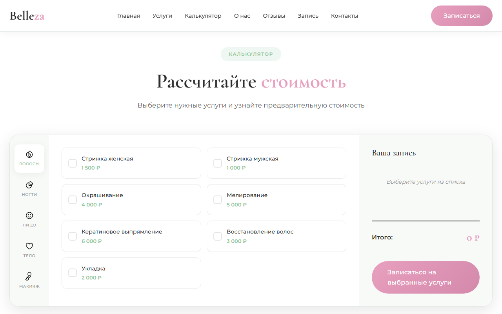

# Belleza — Лендинг салона красоты

Современный адаптивный лендинг для салона красоты премиум класса. Создан с использованием чистого HTML, CSS и JavaScript без фреймворков.

## Демо

🌐 [Посмотреть демо](https://nnnekita.github.io/beauty-salon-sample/)

## Скриншоты

### Главная страница


### Услуги


### Калькулятор стоимости


### Команда мастеров


### Форма записи


## Технологии

- **HTML5** — семантическая разметка
- **CSS3** — Grid, Flexbox, CSS Variables, градиенты, анимации, адаптивный дизайн
- **JavaScript** — Intersection Observer, плавный скролл, мобильное меню, калькулятор стоимости, маска телефона, валидация форм
- **SVG-иконки** — кастомные иконки без зависимостей

## Структура проекта

```
beauty-salon/
├── index.html              # Главная страница
├── css/
│   └── styles.css          # Стили
├── js/
│   ├── calculator.js       # Калькулятор стоимости услуг
│   └── main.js             # Интерактивность
├── icons/                  # SVG-иконки
│   ├── calendar.svg
│   ├── check.svg
│   ├── clock.svg
│   ├── email.svg
│   ├── face.svg
│   ├── hair.svg
│   ├── instagram.svg
│   ├── location.svg
│   ├── makeup.svg
│   ├── massage.svg
│   ├── nails.svg
│   ├── phone.svg
│   ├── sparkle.svg
│   ├── star.svg
│   ├── telegram.svg
│   ├── waxing.svg
│   └── whatsapp.svg
└── screenshots/            # Скриншоты для README
```

## Секции лендинга

1. **Шапка** — фиксированная навигация с эффектом при скролле
2. **Hero** — главный экран с фоновым фото, статистикой и CTA
3. **Услуги** — 6 карточек с фото: парикмахерские, маникюр, косметология, макияж, массаж, депиляция
4. **Калькулятор** — интерактивный расчёт стоимости услуг по категориям
5. **О салоне** — информация, фото и преимущества
6. **Портфолио** — галерея работ (6 фото)
7. **CTA-баннер** — призыв записаться со скидкой
8. **Команда** — 4 карточки мастеров с фото
9. **Отзывы** — 3 отзыва с фото клиентов
10. **Онлайн запись** — форма с выбором услуги, даты, времени
11. **Контакты** — адрес, телефоны, график, email, карта, соцсети
12. **Футер** — навигация и контактная информация

## Особенности

- 🎨 Дизайн в палитре розовый + светло-зелёный
- 📱 Полностью адаптивный дизайн (мобильные, планшеты, десктоп)
- 🧮 Калькулятор стоимости услуг с категориями
- 📝 Форма записи с маской телефона и валидацией
- ✨ Плавные анимации при скролле (Intersection Observer)
- 🖼️ Фоновые фотографии в каждой секции
- 🎯 Модальное окно подтверждения записи
- 🍔 Мобильное меню-бургер
- 💳 Без регистрации — только заявка

## Запуск

Просто откройте `index.html` в браузере:

```bash
# Или запустите локальный сервер
npx serve .
```

## Лицензия

MIT
